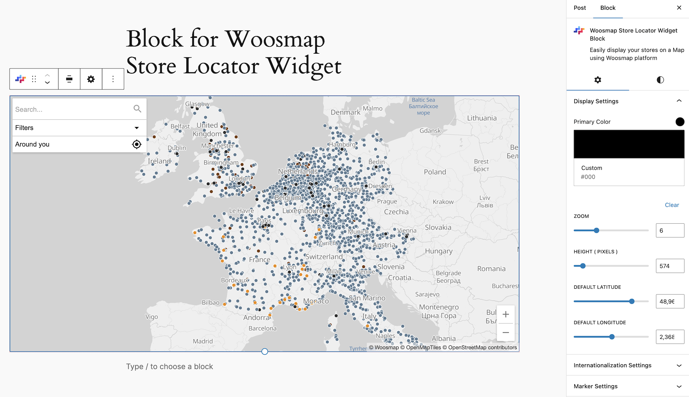
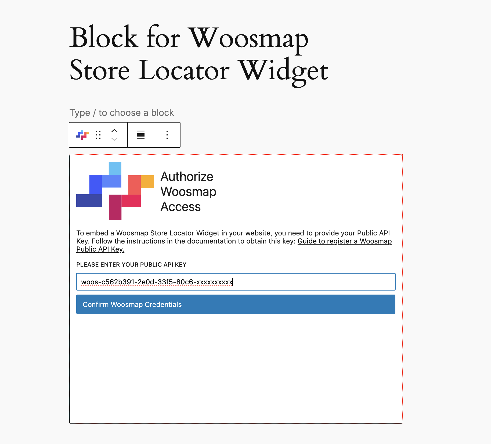
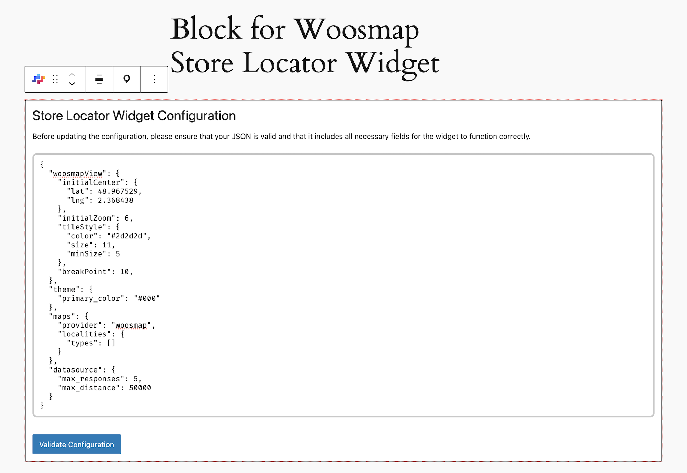

# Woosmap Store Locator Widget Block for Wordpress

Easily integrate
the [Woosmap Store Locator Widget](https://developers.woosmap.com/products/widgets/store-locator-widget/quick-start/)
into your WordPress site with this Gutenberg block plugin, enhancing your site's functionality with a powerful and
customizable store locator.

## Description

The Woosmap Store Locator Widget Block for WordPress allows you to add a store locator to your WordPress site
using the Gutenberg editor. This plugin leverages the Woosmap Store Locator Widget to provide a rich and interactive
experience for users looking for your store locations. With easy customization and setup, you can enhance your site's
user experience in minutes.

The widget supports a broad array of languages, including French, English, Spanish, German, and many more,
catering to a global audience and is designed for fast and advanced display capabilities, ensuring a seamless user
experience.

### Key Features:

- **Multilingual Support**: Available in over 15 languages, such as English, Chinese, and French, catering to
  international brands.
- **Customizable Display**: Users can set a primary color that applies to labels and backgrounds, aligning the locator's
  appearance with their brand identity.
- **Flexible Search**: Adapt the search features to include autocomplete worldwide or for specific countries and
  specific types (address, postal code, etc.), ensuring the functionality best fits your needs.
- **Advanced Display Options**: Offers simplified and markers views for displaying assets, allowing for a clean view or
  detailed markers based on zoom level.
- **Configurable Search Parameters**: Set the number of assets fetched from a user search and bound searches within a
  set radius to accommodate store density.

### Display Customization:

- **Simplified View**: Ideal for rendering a large number of assets or high store density, displaying assets as colored
  dots for faster map loading and a cleaner view.
- **Markers View**: Displays assets as pictograms with customizable images, sizes, and hotspots, suitable for detailed
  branding after a specified zoom level.

### Integration and Customization:

The widget's properties offer versatile customization options: use Form controls for swift adjustments of attributes
like theme color, or dive into an editable JSON Configuration for granular control over the store locator's
functionality and appearance. This adaptability guarantees seamless integration into any website, equipping businesses
with a robust tool to enhance their online presence and engage customers more effectively.

## Installation

Follow these steps to install and activate the Woosmap Store Locator Widget Block:

1. Via WordPress Plugin Directory:
	- Navigate to 'Plugins' > 'Add New' in your WordPress dashboard.
	- Search for 'Store Locator Widget Block'.
	- Click 'Install Now' and then 'Activate'.

2. Manual Installation:
	- Download the plugin as a .ZIP file from the WordPress plugin directory.
	- Navigate to 'Plugins' > 'Add New' > 'Upload Plugin' in your WordPress dashboard.
	- Upload the .ZIP file and click 'Install Now', then 'Activate'.

## Configuration

To begin using the Woosmap Store Locator Widget Block, follow these steps to configure your environment and gain access
to the Woosmap API
for enhancing your site with location services.

### Sign Up for Woosmap

1. If you haven't already, [sign up for a Woosmap account](https://www.woosmap.com/sign_up/) as it's necessary to access
   the Woosmap Console and API keys.
2. [Log in to the Woosmap Console](https://console.woosmap.com/). If you're new to Woosmap, you might need to
   create a project to generate API keys.
3. Navigate to the API keys section and generate a new Public API key for your project. This key will be used to
   authenticate
   your requests to the Woosmap services.

### Configure the Woosmap Store Locator Widget Block

When you create a new Woosmap block, the initial settings screen prompts you to enter the public API Key. If an API Key
has already been configured, this field will be pre-populated with the existing key stored in the Woosmap settings.
After validation, proceed to the Map View to access various editor settings, or edit the JSON Configuration as desired.

